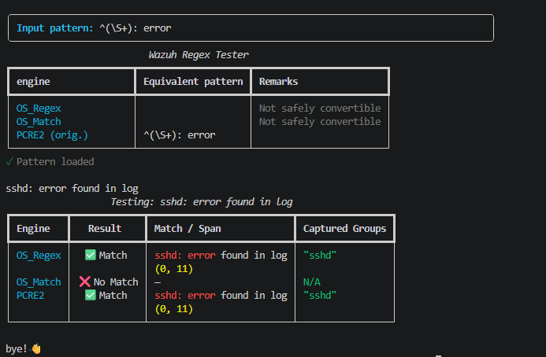

# wazuhregex

`wazuhregex` is a Python package and command-line tool that implements Wazuh regex behavior for local testing and development.
It lets you validate one pattern against [all three Wazuh regex engines](https://documentation.wazuh.com/current/user-manual/ruleset/ruleset-xml-syntax/regex.html) in one run:

- `OS_Regex`
- `OS_Match` (sregex)
- `PCRE2`

The project includes:

- `src/wazuhregex/`: importable Python package and command-line implementation.
- `wazuhregex`: CLI tester with side-by-side engine results.
- `tests/test_wazuhregex.py`: pytest suite that mirrors Wazuh C test coverage.

## Why this exists

Wazuh rules can use regex engines that differ from common online testers. A pattern that works in PCRE-focused tools may fail in `OS_Regex` or `OS_Match`. On the other hand, you can use the original `wazuh-regex` tool, which is deployed on Wazuh manager servers. But that requires you to SSH to the servers for simple checks.

This project gives you a local, repeatable way to check behavior before shipping rules.

## Features

- Test all 3 engines from one command.
- Heuristically detect whether the supplied pattern uses OS_Regex, OS_Match, or PCRE2 syntax, mark that engine with `(orig.)`, and show round-trip-validated alternatives whenever the input can be represented safely. Plain, non-empty literals have no detected original engine because they are valid in all three, and are identified as literals in the `Remarks` column. Ambiguous regex syntax continues to default to PCRE2. Conversion warnings also appear in `Remarks` so unavailable equivalent-pattern cells remain empty.
- Case-insensitive emulation for `OS_Regex` and `OS_Match` behavior.
- Highlighted matches and every match span for each engine.
- Captured groups/substring extraction for `OS_Regex` and `PCRE2`.
- Literal handling for OS_Regex characters that are metacharacters only in PCRE2.
- Lossless stdin handling, including blank records and leading or trailing whitespace.
- Per-engine validation that distinguishes invalid syntax from a valid non-match.

## Installation

The application requires Python 3.11 or newer, with Python 3.13 recommended. For command-line use—the recommended installation for most users—use [pipx](https://pipx.pypa.io/). It installs the application and its dependencies in an isolated environment while exposing the `wazuhregex` command on your `PATH`:

```bash
pipx install wazuhregex
```

When multiple Python interpreters are installed, select the recommended version explicitly with `pipx install --python python3.13 wazuhregex`.

Upgrade or remove the application without affecting other Python tools:

```bash
pipx upgrade wazuhregex
pipx uninstall wazuhregex
```

pipx can also install the application directly from a local checkout:

```bash
pipx install --editable .
```

Contributors should use a virtual environment and install the test dependencies with `python -m pip install -e ".[test]"`.

To import `wazuhregex` in another Python project, install it into that project's environment with pip. This provides both the library and CLI:

```bash
python -m pip install wazuhregex
```

## CLI usage

After installation, use either the console command or module entry point:

```bash
wazuhregex '<PATTERN>'
python -m wazuhregex '<PATTERN>'
```

Then provide input lines via stdin (interactive typing or piping).

### Help/usage output

```bash
wazuhregex --help
```

The command exits with status 2 when the pattern argument is missing or when more than one positional argument is supplied.

### Example: interactive input



### Example: piped input

```bash
printf '%s\n' 'sshd: error found in log' 'info: all good' | wazuhregex 'error'
```

## Python API

The primary classes are available directly from the package:

```python
from wazuhregex import Engine, RegexComparer, WazuhRegex

tool = WazuhRegex(r"(\d+)")

is_match, spans = tool.os_regex("30 Agustos 2020")
if is_match:
    print(spans)                  # [(0, 2), (11, 15)]
    print(tool.get_substrings())  # ["30", "2020"]

is_match, spans = tool.os_match("Error: disk full")
is_match, spans = tool.pcre2_regex("30 Agustos 2020")

comparer = RegexComparer()
parsed = comparer.parse(r"\d+", Engine.PCRE2)
```

## Running tests

Run all tests:

```bash
python -m pytest
```

Run only this package tests:

```bash
python -m pytest tests/test_wazuhregex.py
```

## Notes on behavior differences

- `OS_Regex` emulation translates Wazuh-style tokens before compiling with `pcre2`.
- Because the backend engine supports richer backtracking, edge cases may differ from the original C runtime in some complex patterns.
- `OS_Match` is substring/anchor strategy based and does not return capture groups.

## Building and publishing

Build both the source distribution and wheel, then validate their metadata:

```bash
python -m pip install -e ".[build]"
python -m build
python -m twine check dist/*
```

Releases are published by `.github/workflows/publish.yml` using PyPI trusted publishing (OpenID Connect), so no long-lived API token is stored in GitHub. Before the first release, create a PyPI project or pending trusted publisher for this repository and select `.github/workflows/publish.yml` as its workflow. Publishing is triggered by a published GitHub release and can also be started manually.
